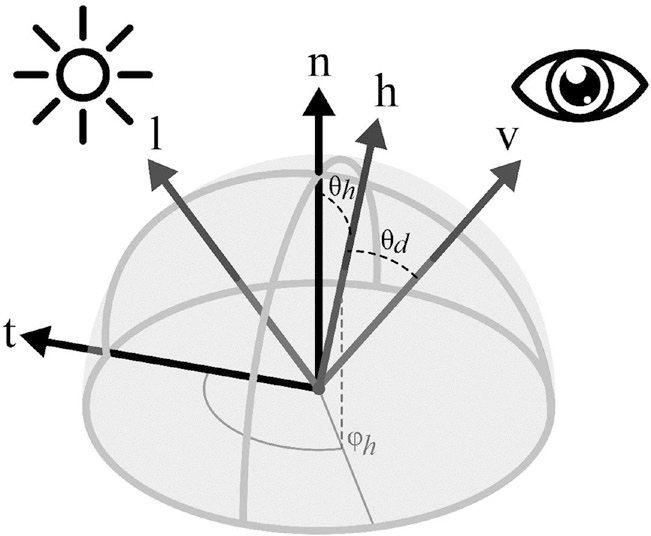

# 유니티 물리 기반 쉐이더 개발

TODO 책 링크

- [Dev Weeks: URP 기본 구성과 흐름](https://www.youtube.com/watch?v=QRlz4-pAtpY)
- [Dev Weeks: URP 셰이더 뜯어보기](https://www.youtube.com/watch?v=9K1uOihvNyg)

``` tree
Packages/
|-- Core RP Library/
|  |-- ShaderLibrary/
|  |  |-- SpaceTransform.hlsl - 공간변환 행렬. Tangent<->World행렬
|  |  |-- Common.hlsl - 각종 수학. 텍스쳐 유틸, 뎁스 계산 ..
|  |  |-- >>> EntityLighting.hlsl - SH, ProveVolume, Lightmap계산 ???
|  |  |-- ImageBasedLighting - IBL관련 부분(GGX, Anisotropy, ImportanceSample)
|-- Universal RP/
|  |-- ShaderLibrary/
|  |  |-- Core.hlsl - 버텍스 인풋 구조체, 스크린UV계산,Fog계산
|  |  |-- Lighting.hlsl - 라이트 구조체, diffuse, specular, GI
|  |  |-- Shadows.hlsl - 쉐도우맵 샘플링, 캐스케이드 계산, ShadowCoord계산 , Shadow Bias계산
|  |-- Shaders/
```

## 1장. 셰이더 개발 과정

### Forward

``` ruby
for object in objects
    for light in lights
        FrameBuffer = LightModel(object, light);
    end
end

for light in lights
    for object in GetObjectsAffectedByLight(light)
        FrameBuffer += LightModel(object, light);
    end
end
```


라이트 갯수 증가> 연산량 증가

### Deferred

``` ruby
for object in objects:
  GBuffer = GetLightingProperties(object)
end

for light in lights
  Framebuffer += LightModel(GBuffer, light)
end
```


- 반투명 불가
- URP - 현재(10.3.1)지원 안함.
  - [URP 로드맵](https://portal.productboard.com/8ufdwj59ehtmsvxenjumxo82/tabs/3-universal-render-pipeline)
- [블라인드 렌더러 -  새로운 기법 != 새 장난감](https://kblog.popekim.com/2012/02/blog-post.html)

## 2장. 첫 유니티 셰이더

- [Built-in vs URP](https://docs.unity3d.com/Packages/com.unity.render-pipelines.universal@10.3/manual/universalrp-builtin-feature-comparison.html)

``` txt
Create> Rendering> Universal Render Pipeline> Pipeline Asset(Forward Renderer)

Assets/
|-- UniversalRenderPipelineAsset.asset
|-- UniversalRenderPipelineAsset_Renderer.asset

Project Settings> Graphics> Scriptable Render Pipeline Settings> UniversalRenderPipelineAsset.asset

UniversalRenderPipelineAsset.asset> Quality> HDR check

Project Settings> Player> Other Settings> Color Space> Linear
```

- [URP unlit basic shader](https://docs.unity3d.com/Packages/com.unity.render-pipelines.universal@10.3/manual/writing-shaders-urp-basic-unlit-structure.html)

``` hlsl
Tags { "RenderType" = "Opaque" "RenderPipeline" = "UniversalPipeline" }
Tags { "LightMode" = "SRPDefaultUnlit" } // 라이트 모드 태그 기본값
```

- [URP ShaderLab Pass tags](https://docs.unity3d.com/Packages/com.unity.render-pipelines.universal@10.3/manual/urp-shaders/urp-shaderlab-pass-tags.html)

| LightMode            | URP Support |
|----------------------|-------------|
| UniversalForward     | O           |
| UniversalGBuffer     | O           |
| UniversalForwardOnly | O           |
| Universal2D          | O           |
| ShadowCaster         | O           |
| DepthOnly            | O           |
| Meta                 | O           |
| SRPDefaultUnlit      | O(기본값)   |
| Always               | X           |
| ForwardAdd           | X           |
| PrepassBase          | X           |
| PrepassFinal         | X           |
| Vertex               | X           |
| VertexLMRGBM         | X           |
| VertexLM             | X           |

## 3장. 그래픽스 파이프라인

``` cs
// #include "Packages/com.unity.render-pipelines.universal/ShaderLibrary/Core.hlsl"
// |-- #include "Packages/com.unity.render-pipelines.core/ShaderLibrary/Common.hlsl"

// Core RP Library/ShaderLibrary/SpaceTransforms.hlsl

// UNITY_MATRIX_M * (UNITY_MATRIX_VP * positionOS)

float4 TransformObjectToHClip(float3 positionOS)
{
    // More efficient than computing M*VP matrix product
    return mul(GetWorldToHClipMatrix(), mul(GetObjectToWorldMatrix(), float4(positionOS, 1.0)));
}
```

## 4장. 좌표 공간 변환

| Space |                        |
|-------|------------------------|
| WS    | world space            |
| VS    | view space             |
| OS    | object space           |
| CS    | Homogenous clip spaces |
| TS    | tangent space          |
| TXS   | texture space          |

| built-in(legacy)         | URP                          |
|--------------------------|------------------------------|
| UnityObjectToWorldDir    | TransformObjectToWorldDir    |
| UnityObjectToWorldNormal | TransformObjectToWorldNormal |
| UnityWorldSpaceViewDir   | TransformWorldToViewDir      |
| UnityWorldSpaceLightDir  | x                            |

``` hlsl
float4x4 GetObjectToWorldMatrix() UNITY_MATRIX_M;
float4x4 GetWorldToObjectMatrix() UNITY_MATRIX_I_M;
float4x4 GetWorldToViewMatrix()   UNITY_MATRIX_V;
float4x4 GetWorldToHClipMatrix()  UNITY_MATRIX_VP;
float4x4 GetViewToHClipMatrix()   UNITY_MATRIX_P;
```

| built-in(legacy)     | URP                    |
|----------------------|------------------------|
| UnityObjectToClipPos | TransformObjectToHClip |
| UnityWorldToClipPos  | TransformWorldToHClip  |
| UnityViewToClipPos   | TransformWViewToHClip  |

- <https://github.com/Unity-Technologies/Graphics/tree/master/com.unity.render-pipelines.core>
- <https://github.com/Unity-Technologies/Graphics/tree/master/com.unity.render-pipelines.universal>

## 5장. 최초 라이팅 셰이더

``` hlsl
// #include "Packages/com.unity.render-pipelines.universal/ShaderLibrary/Lighting.hlsl"
struct Light
{
    half3   direction;
    half3   color;
    half    distanceAttenuation;
    half    shadowAttenuation;
};

Light GetMainLight()

Light GetMainLight(float4 shadowCoord)

// #include "Packages/com.unity.render-pipelines.core/ShaderLibrary/Macros.hlsl"
#define TRANSFORM_TEX(tex, name) ((tex.xy) * name##_ST.xy + name##_ST.zw)


// #include "Packages/com.unity.render-pipelines.core/ShaderLibrary/API/D3D11.hlsl"
#define SAMPLE_TEXTURE2D(textureName, samplerName, coord2)                               textureName.Sample(samplerName, coord2)
```

- [URP - Drawing a texture](https://docs.unity3d.com/Packages/com.unity.render-pipelines.universal@10.3/manual/writing-shaders-urp-unlit-texture.html)

## 6장. 스펙큘러 구현

- TODO 더 많은 광원 지원하기(2 Directional Light)
- <https://catlikecoding.com/unity/tutorials/scriptable-render-pipeline/lights/>

## 7장. 서피스 셰이더

Skip

## 8장. 물리 기반 셰이딩이란?

빛을 측정하는 방법
입체각 Solid Angle - 단위는 sr(steradian)
단위 구로 어떠한 형상을 사영한 것.

파워 W(power) 여러 방향에서 표면을 통과해 전달되는 에너지 크기
일레디안스 모든 광선에서 점에 전달되는 빛의 크기  Irradiance E (W/m^2)
레디안스 하나의 광선에서 점에 전달되는 빛의 크기 Radiance L_0 (W/(m^2 * sr))

재질을 표현하는 방법
양방향 반사 분포 함수 BRDF Bidirectional Reflectance Distribution Function
빛이 표면에서 어떻게 반사될지에 대해 정의한 함수.

| BRDF 속성              |                                                                                              |
|------------------------|----------------------------------------------------------------------------------------------|
| positivity             | BRDF값은 0이상이다                                                                           |
| symmetry (reciprocity) | 빛이 들어오는 방향과 반사되는 방향의 값은 동일하다                                           |
| conservation of energy | 나가는 빛의 양은 들어오는 빛의 양을 넘어설 수 없다(물체가 자체적으로 빛을 발산하지 않는다면) |

미세면 이론
|              |   |
|--------------|---|
| 프레넬       | F |
| 정규분포함수 | D |
| 기하함수     | G |

## 9장. 물리 기반 셰이더 제작하기

phong

``` hlsl
half3 LightingPhong(half3 lightColor, half3 lightDir, half3 normal, half3 viewDir, half4 specularColor, half3 albedo, half shininess)
{
    half NdotL = saturate(dot(normal, lightDir));
    half3 diffuseTerm = NdotL * albedo * lightColor;

    half3 reflectionDirection = reflect(-lightDir, normal);
    half3 specularDot = max(0.0, dot(viewDir, reflectionDirection));
    half3 specular = pow(specularDot, shininess);
    half3 specularTerm = specularColor.rgb * specular * lightColor;

    return diffuseTerm + specularTerm;
}

// Lafortune and Willems (1994)
half3 LightingPhongModified(half3 lightColor, half3 lightDir, half3 normal, half3 viewDir, half4 specularColor, half3 albedo, half shininess)
{
    half NdotL = saturate(dot(normal, lightDir));
    half3 diffuseTerm = NdotL * albedo * lightColor;

    half norm = (shininess + 2) / (2 * PI);

    half3 reflectionDirection = reflect(-lightDir, normal);
    half3 specularDot = max(0.0, dot(viewDir, reflectionDirection));

    half3 specular = norm * pow(specularDot, shininess);

    half3 specularTerm = specularColor.rgb * specular * lightColor;

    return diffuseTerm + specularTerm;
}
```

## 10장. 후처리 효과

``` hlsl
// com.unity.render-pipelines.core/ShaderLibrary/API/D3D11.hlsl
#define SAMPLE_TEXTURE2D(textureName, samplerName, coord2)                               textureName.Sample(samplerName, coord2)
#define SAMPLE_DEPTH_TEXTURE(textureName, samplerName, coord2)          SAMPLE_TEXTURE2D(textureName, samplerName, coord2).r
```

``` hlsl
// com.unity.render-pipelines.core/ShaderLibrary/API/Common.hlsl
// Z buffer to linear 0..1 depth (0 at near plane, 1 at far plane).
// Does NOT correctly handle oblique view frustums.
// Does NOT work with orthographic projection.
// zBufferParam = { (f-n)/n, 1, (f-n)/n*f, 1/f }
float Linear01DepthFromNear(float depth, float4 zBufferParam)
{
    return 1.0 / (zBufferParam.x + zBufferParam.y / depth);
}

// Z buffer to linear 0..1 depth (0 at camera position, 1 at far plane).
// Does NOT work with orthographic projections.
// Does NOT correctly handle oblique view frustums.
// zBufferParam = { (f-n)/n, 1, (f-n)/n*f, 1/f }
float Linear01Depth(float depth, float4 zBufferParam)
{
    return 1.0 / (zBufferParam.x * depth + zBufferParam.y);
}

// Z buffer to linear depth.
// Does NOT correctly handle oblique view frustums.
// Does NOT work with orthographic projection.
// zBufferParam = { (f-n)/n, 1, (f-n)/n*f, 1/f }
float LinearEyeDepth(float depth, float4 zBufferParam)
{
    return 1.0 / (zBufferParam.z * depth + zBufferParam.w);
}

// Z buffer to linear depth.
// Correctly handles oblique view frustums.
// Does NOT work with orthographic projection.
// Ref: An Efficient Depth Linearization Method for Oblique View Frustums, Eq. 6.
float LinearEyeDepth(float2 positionNDC, float deviceDepth, float4 invProjParam)
{
    float4 positionCS = float4(positionNDC * 2.0 - 1.0, deviceDepth, 1.0);
    float  viewSpaceZ = rcp(dot(positionCS, invProjParam));

    // If the matrix is right-handed, we have to flip the Z axis to get a positive value.
    return abs(viewSpaceZ);
}

// Z buffer to linear depth.
// Works in all cases.
// Typically, this is the cheapest variant, provided you've already computed 'positionWS'.
// Assumes that the 'positionWS' is in front of the camera.
float LinearEyeDepth(float3 positionWS, float4x4 viewMatrix)
{
    float viewSpaceZ = mul(viewMatrix, float4(positionWS, 1.0)).z;

    // If the matrix is right-handed, we have to flip the Z axis to get a positive value.
    return abs(viewSpaceZ);
}
```

|        | Built-in      | URP                   |
|--------|---------------|-----------------------|
| Camera | Camera:       | RenderPipelineManager |
|        | OnPreCull     | beginFrameRendering   |
|        | OnPreRender   | beginCameraRendering  |
|        | OnPostRender  | endCameraRendering    |
|        | OnRenderImage | endFrameRendering     |

`Create> Rendering> Universal Render Pipeline> Renderer Feature`

|                            | 자동 생성됨 |                                   |
|----------------------------|-------------|-----------------------------------|
| _CameraDepthTexture        | O           | Pipeline Settings> Depth Texture  |
| _CameraOpaqueTexture       | O           | Pipeline Settings> Opaque Texture |
| _CameraColorTexture        | ??          |                                   |
| _CameraDepthNormalsTexture | X           |                                   |

- <https://docs.unity3d.com/Packages/com.unity.render-pipelines.universal@10.3/manual/integration-with-post-processing.html>

``` txt
- Camera> Rendering> Post-Processing 체크
- Hierachy> Volume> Global Volume
- Global Volume> Volume> Profile> New
- Global Volume> Volume> Add Override
```

## 11장. BRDF 누가 누구인가?

- <https://github.com/wdas/brdf>
- <https://github.com/wdas/brdf/downloads>
- <https://www.disneyanimation.com/publications/physically-based-shading-at-disney/>
- [[ 번역 ] Physically-Based Shading at Disney](https://lifeisforu.tistory.com/350)



| 기호 | 설명                              |
|------|-----------------------------------|
| N    | 노말                              |
| H    | 하프벡터 `H = normalize( L + V )` |
| L    | 라이트(광원)                      |
| V    | 뷰(카메라)                        |
| T    | 탄젠트                            |
| Θ    | (Theta) 방위각                    |
| Φ    | (Phi)  앙각(올려본각)             |

### BRDF 종류

- 어크먼 셜리
- 쿡토렌스
- 오렌네이어
- 알드
- 디즈니

#### Ashikhmin Shirley

2000 - Michael Ashikhmin & Peter Shirley - An Anisotropic Phong BRDF Model

퐁 스펙큘러

#### Cook Torrance

1982 - Robert L.Cook & Kenneth E. Torrance - A Reflectance Model For Computer Graphics

미세면이론

#### Oren Nayar

1994 - Michael Oren & Shree K. Nayar - Generalization of Lambert’s Reflectance Model

디퓨즈 전용

#### Ward

1992 - Gregory J. Ward - Measuring and modeling anisotropic reflection

경험적 데이터 기반, 거의 사용되지 않음.

#### Disney

SIGGRAPH 2012 - Brent Burley - Physically Based Shading at Disney

여러 파라미터

## 12장. BRDF 구현하기

### 레퍼런스 BRDF

#### Cook Torrance 레퍼런스

미세면이론

1982 - Robert L.Cook & Kenneth E. Torrance - A Reflectance Model For Computer Graphics

|                                                                                      |                                                                    |
|--------------------------------------------------------------------------------------|--------------------------------------------------------------------|
| Physics and Math of Shading by Naty Hoffman                                          | SIGGRAPH every year from 2012 to 2015                              |
| Real Shading in Unreal Engine 4 by Brian Karis                                       | SIGGRAPH, 2013                                                     |
| BRDF Explorer (GLSL) - CookTorrance BRDF                                             |                                                                    |
| Specular BRDF Reference on Brian Karis’ blog                                         | <graphicrants.blogspot.co.uk/2013/08/specular-brdf-reference.html> |
| Introduction to BRDF Models by Daniël Jimenez Kwast                                  |                                                                    |
| A Reflectance Model for Computer Graphics from 1981                                  |                                                                    |
| Understanding the Masking-Shadowing Function in Microfacet-Based BRDFs by Eric Heitz | SIGGRAPH, 2014 - 미세면이해 추천                                   |
| Microfacet Models for Refraction through Rough Surfaces                              | EGSR, 2017                                                         |

#### Disney 레퍼런스

직관적 파라미터 좋은 예제, 구현 복잡

|                                                                           |                                                                                    |
|---------------------------------------------------------------------------|------------------------------------------------------------------------------------|
| Physically Based Shading at Disney                                        | SIGGRAPH, 2012, by Brent Burley                                                    |
| BRDF Explorer (GLSL) - Disney BRDF                                        |                                                                                    |
| Extending the Disney BRDF to a BSDF with Integrated Subsurface Scattering | SIGGRAPH, 2015, by Brent Burley                                                    |
| Moving Frostbite to Physically Based Rendering                            | SIGGRAPH, 2015, by Sébastien Lagarde and Charlesde Rousiers (only for the Diffuse) |

### 이론 BRDF

#### Cook Torrance 이론

미세면 이론
|   |              |              |
|---|--------------|--------------|
| F | Fresnel      | 프레넬       |
| D | Distribution | 정규분포함수 |
| G | Geometry     | 기하함수     |

NDF : Normal Distribution Function : 정규분포함수

- NDF
  - Beckmann
  - Phong
  - GGX

#### Disney 이론

### 구현 BRDF

#### Cook Torrance 구현

#### Disney 구현

## 13장. 표준 셰이더 후킹

## 14장. 고급 기술 구현

## 15장. 아티스트가 사용할 셰이더 제작

아티스트가 조작하기 편하게

1. 적절한 셋팅 갯수
2. 적절한 셋팅 네이밍
3. 상호 작용하는 셋팅값을 위한 문서화
4. 텍스쳐에 여러 정보(albedo + specular등)을 넣는 경우가 많은데, 명확하게 셋팅값과 셋팅 네이밍을 표시
5. 여러 범위 혼합사용 피하기(되도록이면 `0 ~ 1`로...)

파라미터 변화값 별로 예제 씬 있으면 좋겠네..

## 16장. 복잡도와 우버셰이더

쉐이더 하나를 이용해서 여러가지 경우를 처리하고 싶은 경우, 필요한 모든 코드를 쉐이더 하나에 집어넣게되면 그게 바로 우버셰이더.

- `if`와 같은 동적분기는 성능저하.
- `#if`와 같이 전처리기를 이용한, 정적 분기를 이용하여 처리한다.

유니티에서는 키워드를 이용 쉐이더 조합을 편리하게 해주는 기능이 있음.

- [Shader variants and keywords](https://docs.unity3d.com/2021.1/Documentation/Manual/SL-MultipleProgramVariants.html)
- 총 256개의 글로벌 키워드.
- 64개의 로컬 키워드.

- `#pragma shader_feature KEYWORD
- `#pragma multi_compile KEYWORD`

|                | 게임빌드에 포함     |
|----------------|---------------------|
| shader_feature | 사용되는 것만       |
| multi_compile  | 조합 가능한 모든 것 |

``` txt
#pragma multi_compile A B C
#pragma multi_compile D E

조합해서 나올 수 있는 총 갯수: 6개
A+D, B+D, C+D
A+E, B+E, C+E
```

## 17장. 셰이더가 정상작동하지 않을 때

### 일반적 트릭

- shader로 노말값 시각화

### 디버깅 도구

- Window> Analysis> Frame Debugger
- RenderDoc 프로그램
  - <https://renderdoc.org/>

### 프로파일링

|                                 |  |
|---------------------------------|--|
| 배치 수                         |  |
| 드로우콜                        |  |
| SetPass                         |  |
| Vertex                          |  |
| 텍스쳐 갯수/메모리 /스위치 횟수 |  |
| Shadow Casters                  |  |
| Vertex Buffer Object            |  |

- CPU에 치중? GPU에 치중?
- Static GameObject 활용 잘하기.

## 18장. 최선 트렌드 따라잡기

### 컨퍼런스

|                 |                              |
|-----------------|------------------------------|
| GDC             | GDC Vault 구독 1년 400불정도 |
| Siggraph        | 1년 45달러                   |
| Unite           |                              |
| Digital Dragons | 영상자료 공개                |
| Eurographics    | 학술위주                     |

### 서적

어렵지만 구입해서 읽어볼 가치 있음.

|          |  |
|----------|--|
| GPU Gems |  |
| ShaderX  |  |
| GPU PRO  |  |
| GPU Zen  |  |

### 사이트

- <http://blog.selfshadow.com/publications/>
- <https://labs.unity.com/>
- <http://filmicworlds.com/>
- <http://aras-p.info/>
- <https://seblagarde.wordpress.com/>
- <http://c0de517e.blogspot.co.uk/>
- <http://blog.tobias-franke.eu/>
- <https://bartwronski.com/>
- <http://bitsquid.blogspot.co.uk/>
- <http://casual-effects.blogspot.co.uk/>
- <http://kesen.realtimerendering.com/>
- <http://graphicscodex.com>
- <https://www.scratchapixel.com/>

## etc

- [Microfacet BRDF](http://www.pbr-book.org/3ed-2018/Reflection_Models/Microfacet_Models.html#)
- http://www.pbr-book.org/